# Lightning Web Components Specialist
[](https://shunkosa.gitbook.io/trailhead-superbadge-jp/lwc-specialist) [](https://github.com/shunkosa/trailhead-superbadge-jp/blob/master/src/lwc-specialist/lwc-specialist.md)
- Trailhead のスーパーバッジ、[Lightning Web Components Specialist](https://trailhead.salesforce.com/content/learn/superbadges/superbadge_lwc_specialist) の日本語訳(**非公式**)です。
- 各カスタマイズ要素のラベル部分には補足として日本語を括弧内に記載している場合がありますが、正解チェックは英語のラベルを元に行われるため、実際のチャレンジには日本語表記を含めず、英語表記のみを使用して行って下さい。また、チャレンジ前にユーザと組織の言語・ロケールを英語に切り替えておくことを推奨します。 

---
## このスーパーバッジを取得するためにすること
1. 機能的な Lightning Web コンポーネントで Salesforce Lightning Design System (SLDS) を使用します。
2. Visualforce ページを Lightning Web コンポーネントを使用したソリューションに変換します。
3. Lightning アプリケーションビルダー、Lightning Experience、Salesforce アプリケーション、および Lightning アプリケーションで、Lightning Web コンポーネントを表示します。
4. 管理者がカスタムコンポーネントを設定できるようにします。
5. カスタムオブジェクトからデータを読み取るための Apex コントローラメソッドを作成し呼び出します。
6. コンポーネントイベントとパブリックメソッドを使用して、密に結合されたコンポーネント間の通信を可能にします。
7. 疎結合コンポーネント間の通信を可能にします。
8. Lightning データサービスを使用して、カスタムオブジェクトのデータを読み書きします。
9. Lightning Web コンポーネントで外部 JavaScript をカスタマイズして使用します。
10. JavaScript コードのトラブルシューティングを行います。
11. Lightning Web コンポーネントをテストする方法を説明します。
12. モジュールをインポート、エクスポート、継承します。

## このスーパーバッジでテストする概念
* Lightning アプリケーションビルダーで使用するための Lightning Web コンポーネントの開発
* Lightning データサービスの使用
* JavaScript を使用したユーザインタラクションの処理
* コンポーネントのトラブルシューティング
* UX コントロールの動的な表示と非表示
* カスタムオブジェクトのデータの読み書き
* コンポーネント間の通信
* ネイティブの Salesforce 機能の活用
* Lightning Web コンポーネント内での外部 JavaScript の使用

所用時間 : 推定 12 時間 

## 事前準備とメモ
- 紙とペンを用意して、要件を読み進める際にメモを取ってください。
- このスーパーバッジのために新しい Trailhead Playground または [Developer 組織](https://developer.salesforce.com/signup) を作成して、Lightning Message Service チャネルをデプロイできるようにします。また、この組織を他のモジュールやタスクに利用すると Challenge の検証のために問題を引き起こす可能性があります。Trailhead Playground では既に私のドメインが有効になっていることに注意してください。私のドメインの設定は編集しないでください。Trailhead Playground にログインできなくなる可能性があります。
<!-- textlint-disable jtf-style/4.3.7.山かっこ<> -->
-  **設定 > セキュリティ > セッションの設定** セクションで、**パフォーマンスを向上させるためにブラウザの安全で永続的なキャッシュを有効にする** のチェックをオフにすることで、コンポーネントのキャッシュを無効化してください。これにより、コードをデプロイした直後に変更内容を確認することができ、コンポーネントのキャッシュによる遅延が発生しません。
<!-- textlint-enable jtf-style/4.3.7.山かっこ<> -->
-  [このロック解除済みパッケージ](https://login.salesforce.com/packaging/installPackage.apexp?p0=04t6g000008ar8gAAA)をインストールしてください。(パッケージ ID: 04t6g000008ar8gAAA) このパッケージには、Challenge を完了するために必要となる全てのスキーマと、Lightning Web コンポーネントと Apex ロジックの最初のコードが含まれます。ロック解除済みパッケージのインストールに問題が発生した場合は[Trailhead Playground の管理](https://trailhead.salesforce.com/ja/content/learn/modules/trailhead_playground_management)の手順に従ってください。
- Challenge 1 でロック解除済みパッケージのインストールを検証した後、サンプルデータが自動的に組織に追加されます。最初の Challenge を検証後、何らかの理由で組織を変更する場合は、`GenerateData.apxc` の静的メソッド `initData()` を実行してください。
- デプロイを確実に成功させるため、要件に指定される命名規則に従ってください。
- 以下の詳細な要件を読みながら、設定された組織のデータスキーマを確認してください。
- Salesforce DX CLI および Visual Studio Code を含む、Lightning Web コンポーネントの開発ツールを設定してください。

### 備考
チャレンジを始める前に、[Lightning Web Components Specialist: Trailhead Challenge Help (英語)](https://trailhead.salesforce.com/help?article=Lightning-Web-Components-Specialist-Superbadge-Trailhead-Challenge-Help) のナレッジ記事を参照してください。このヘルプ記事は、よくある質問と回答で Trailblazer をサポートするように設計されています。また、役立つ記事へのリンクや、さまざまなトラブルシューティングのテクニックについても説明しています。

要件とシナリオをよく読み込んでください。現実の状況をシミュレートするために、特定の順番で要件が提示されており、ドキュメントを読みながらコンポーネント間の依存関係を特定する必要があります。

Challenge がチェックされる順番でコンポーネントを開発することをお勧めします。

Lightning Web コンポーネントは大文字と小文字を区別する言語を使用しているので、コードに正しい大文字と小文字を適用していることを確認してください。

## ユースケース
世界最大のレクリエーショナル・ビークル (RV) のレンタル企業である HowWeRoll Rentals は、この数年間で、RV 車のレンタル市場を独占するようになりました。彼らのキャッチフレーズは、「私たちは素晴らしいサービスを提供します、なぜならそれが How We Roll だから！」です。彼らは、豪華な移動式の家のようなものから、伝統的なクロムめっきのエアストリーム [*1](#footnote1) まで、あらゆるスタイルのキャンピングカーを取り揃えています。もしあなたが旅行熱に悩まされているなら、彼らには治療法があります！

あなたは HowWeRoll の Salesforce の主任開発者として、会社を大成功させるために尽力してきました。RV 車で旅行する人の大部分がボートを所有していることが調査によって明らかになったため、収益を拡大し続けるために、同社の経営陣は彼らのコアである RV 車市場を超えて拡大し、レクリエーションボート業界に参入することを決めました。HowWeRoll は、自社のボートの獲得に多額の投資をするのではなく、ボートのシェアリングプログラムを開始し、それによって同社が顧客のボートのリース代理店として機能することを計画しています。HowWeRoll はこの新しいサービスを Friend Ships と呼んでいます。

Tatiana Loyal は HowWeRoll の Salesforce 開発者です。彼女は Lightning Experience で表示できるカスタム Lightning インターフェースの実装を開始しましたが、現在は産休に入っています。彼女の仕事であった、セールスアソシエイトが顧客のボートの場所などの情報を入力できるようにする Lightning アプリケーションの開発を引き継いでほしいと頼まれています。また、各ボートを視察した際に、チームメンバーが体験したことをコメントや評価として投稿できるようにすることも求められています。

最初からやり直すのではなく、Tatiana が書いたコードから始めます。優れたプログラマーは優れたコードを書き、偉大なプログラマーは優れたコードを再利用します。

最初にカスタム検索エンジンを開発し、HowWeRoll のセールスアソシエイトがボート種別 (釣り船、プレジャーボート、パーティーボート等) に基づいて動的にボートをフィルタリングし、顧客のリクエストとボートの在庫を一致させることができるようにします。

次に、現在のユーザの場所に基づいて 10 艇までのボートを表示する地図を作成します。

最後に、似たボートを検索クエリに表示する既存の旧式の Visualforce ページを、Lightning Web コンポーネントを使用して再利用可能なソリューションに変換します。

## 主要なステークホルダとチーム
* Solange Pereira (CEO)
* Weimar Williams (Salesforce システム管理者)
* Byanca Gowda (Salesforce アーキテクト)
* Renata Pan (UX エンジニア)
* Tatiana Loyal (Salesforce 開発者)

## 標準オブジェクト
以下の標準オブジェクトを扱います。

* **Contact** (取引先責任者) - 組織の連絡先でありボートの所有者
* **User** (ユーザ) - ボートにレビューやコメントを投稿する人

## カスタムオブジェクト
* **Boat** (ボート) - 取引先責任者が所有するボートに関する情報。このオブジェクトには、ボートがいつも利用する波止場を地図上にプロットするための地理位置情報項目があります。このオブジェクトは、標準の取引先責任者オブジェクトと主従関係にあり、BoatType (ボート種別)オブジェクトへの参照関係項目があります。
* **BoatType** (ボート種別) - 漁船、モーターボード、ヨット、パーティボートのような、様々なボートの種類。
* **BoatReview** (ボートレビュー) - ボートのコメントと評価。このオブジェクトは **Boat (ボート)** と主従関係です。そのため、1つのボートに複数のコメントや評価を付けることができます。

## エンティティ図
設定から、クイック検索ボックスに`スキーマビルダー`と入力し、**スキーマビルダー**を選択し、インタラクティブなバージョンの画像を表示します。詳しくは、[データモデリング](https://trailhead.salesforce.com/ja/modules/data_modeling) モジュールの「スキーマビルダーの使用」単元を参照してください。

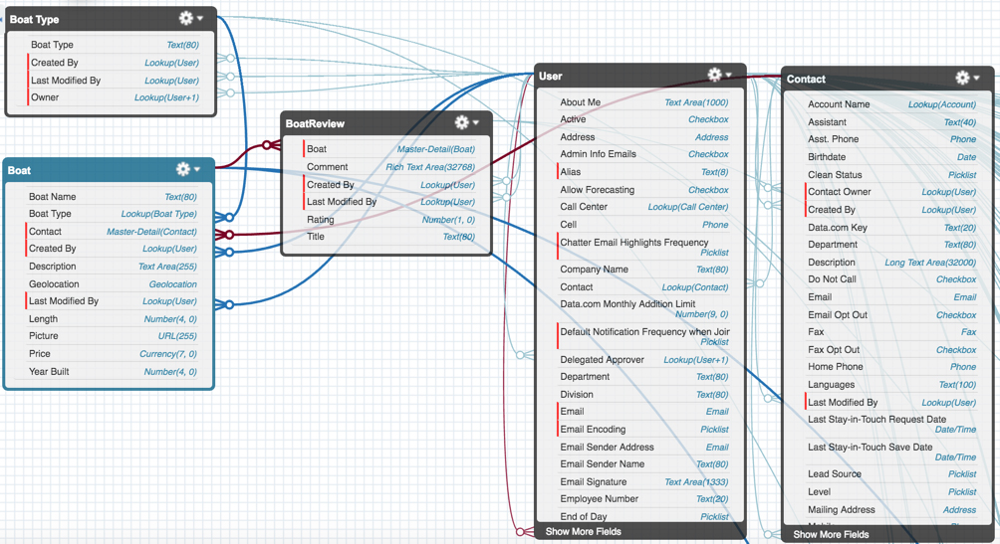
 
## アプリケーション設計
HowWeRoll の主要なステークホルダとのミーティングに費やした時間はあなたにとって価値がありました。チームは以下のような Lightning ページの設計図を提案しました。はじめに、**Gallery (ギャラリー)** です。


以下が、**Boats Near Me (近くにあるボート)** タブです。一覧には、現在のユーザの位置に基づいてボートが表示されます。

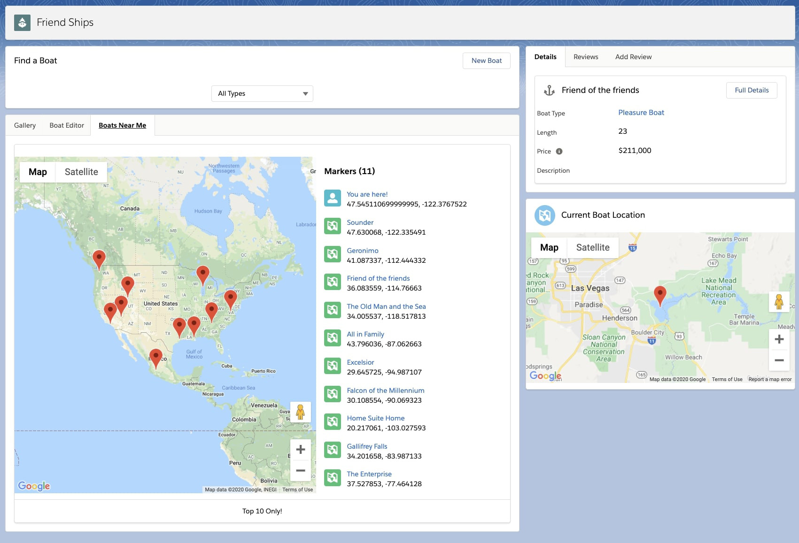

続いて、**Boat Editor (ボートエディタ)** タブです。Lightning データテーブルにより複数のレコードを一度に編集することができます。

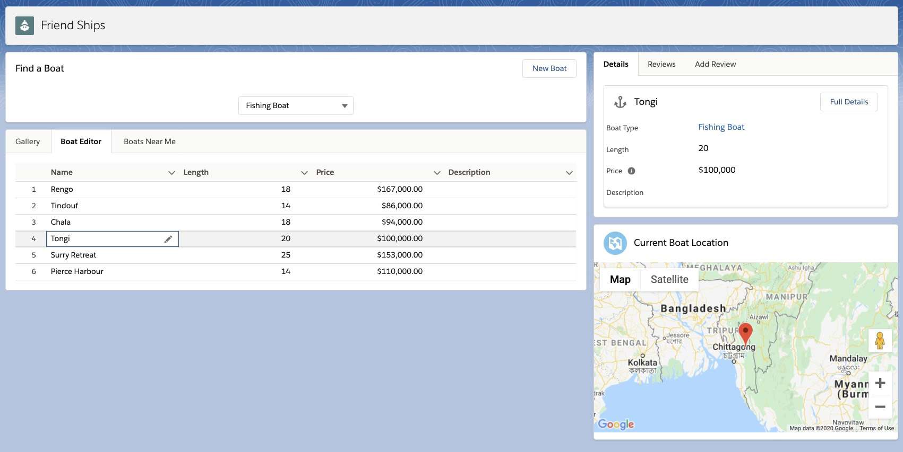

以下に示すように、**Boat Reviews (ボートのレビュー)** と **Rating System (評価システム)** コンポーネントも開発してください。

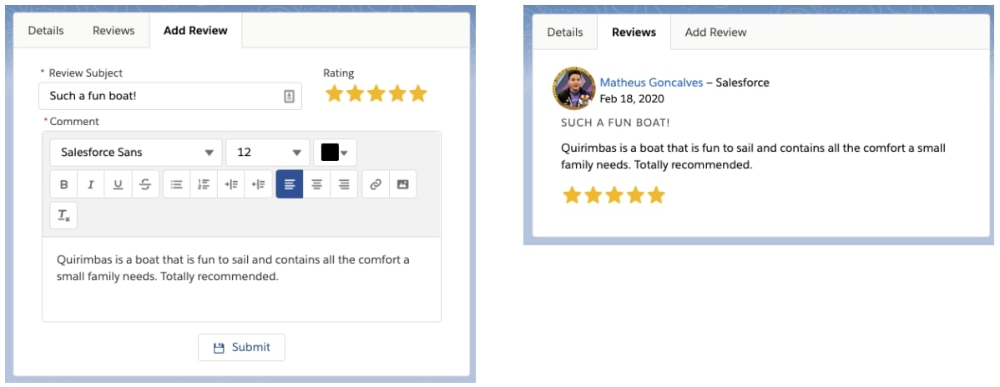

これからのタスクの大きさを見積した後、あなたは一杯のコーヒーまたは好みの飲み物を飲み、そして大きなタスクを乗り越えるための最良の方法はそれをより小さな部品に分割することであると判断します。以下の通りフェーズを計画します。それらが完了すると、確かな完成品となります。
  
## ボートのメッセージサービスチャネルを構築する
Document Object Model (DOM) をまたがる通信を行うためには、Lightning Message Service チャネルを作成します。Salesforce の開発者であれば、Lightning Web コンポーネントが [Lightning Message Service](https://developer.salesforce.com/blogs/2019/10/lightning-message-service-developer-preview.html) チャネルを使用して、Lightning Message Service API にアクセスできることはご存知でしょう。メッセージチャネルには、以下の設定を使用してください。

<!-- textlint-disable jtf-style/1.1.3.箇条書き -->
* Description (説明) : `This is a sample Lightning Message Channel for the Lightning Web Components Superbadge.`
* メッセージチャネルを公開 (isExposed) してください。
* `<lightningMessageFields>` に `recordId` 項目 (ボートのレコード ID)を設定してください。
* MasterLabel (表示ラベル) : `BoatMessageChannel`
<!-- textlint-enable jtf-style/1.1.3.箇条書き -->
[メッセージチャネルを組織にデプロイ](https://developer.salesforce.com/docs/atlas.en-us.lightning.meta/lightning/message_channel_create.htm)して、Lightning Web コンポーネント内で参照できるようにします。それを新しい `@salesforce/messageChannel` スコープモジュールからインポートし、必要に応じて関数やコンテキスト、スコープを含めてください。

```xml
<?xml version="1.0" encoding="UTF-8"?>
<LightningMessageChannel xmlns="http://soap.sforce.com/2006/04/metadata">
    <description>This is a sample Lightning Message Channel for the Lightning Web Components Superbadge.</description>
    <isExposed>true</isExposed>
    <lightningMessageFields>
        <description>This is the record Id that changed</description>
        <fieldName>recordId</fieldName>
    </lightningMessageFields>
    <masterLabel>BoatMessageChannel</masterLabel>
</LightningMessageChannel>
```

JavaScript ファイル内でメッセージチャネルをインポートする際は、**BOATMC** という名前を使用してください。

```js
// imports 
// { functions, context, scope } 
import { ..., ..., ... } from 'lightning/messageService';
import BOATMC from '@salesforce/...';
```

## 出港しましょう！
ボートは港に停泊している方が安全ですが、それはボートの目的ではありません。出航しましょう！100 万海里の旅は、1 行のコードから始まりますよね？

`New Boat` (新規ボート) ボタンとともに、ボート種別を一覧表示するドロップダウンリスト付きのフォームを表示して、あなたの旅のエンジンを稼働させましょう。

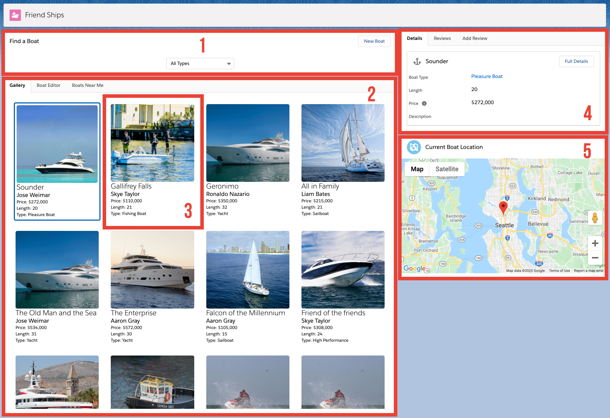

*図: コンポーネントを構築する。メインの画面と5つに分割されたセクション。1. Find a Boat (ボートを探す) 2. Search Results (検索結果) 3. Boat Tile (ボートタイル) 4. Record details and boat reviews (レコードの詳細とボートのレビュー) 5. Current boat location (現在のボートの位置)*

フォームを構築するために、必要なコンポーネントをすべて作成してください。上の図では、各セクションは対応する番号でハイライトされており、複数のコンポーネントが含まれる場合があります。深く潜る準備はできていますか？あなたならできます！

### 検索フォームを構築し新しい Lightning ページに追加する
`boatSearch` コンポーネントは `boatSearchForm` と `boatSearchResults` の両方を呼び出すコンテナコンポーネントです。これには、複数の行を持つ `<lightning-layout>` が含まれ、上にはサイズが `12` に等しい `<lightning-layout-item>`、タイトルが "Find a Boat" の `<lightning-card>`、下にはサイズが `12` に等しい `<lightning-layout-item>` が含まれます。

標準の `<lightning-spinner>` を `boatSearch` に含め、`alternative-text = "Loading"` を使用します。スピナーは、Salesforce Lightning Design System (SLDS) ブランドカラーと一致している必要があります。

フォームがボートをロード中にスピナーを表示します。属性 `isLoading` は、以下の 2 つのメソッドで使用します。`handleLoading()` と `handleDoneLoading()` です。

コンポーネント `boatSearch` には、新しいボートを作成するためのボタンも必要です。シンプルなデザインを維持するために Byanca は `actions` という slot の中で `<lightning-button>` を使うように要求しました。これに `New Boat` というラベルを付け、`createNewBoat()` という名前の関数を呼び出して `NavigationMixin` を継承して標準フォームを開き、ユーザが新しいボートレコードを作成できるようにします。

#### マークアップ (boatSearch.html)
```html
<template>
  <lightning-layout multiple-rows>
    <!-- Top -->
    <lightning-layout-item size="12">
      <lightning-card title="Find a Boat">
        <!-- New Boat button goes here -->
        <p class="slds-var-p-horizontal_small">
          <!-- boatSearchForm component goes here -->
        </p>
      </lightning-card>
    </lightning-layout-item>
    <!-- Bottom -->
    <lightning-layout-item size="12" class="slds-p-top_small slds-is-relative">
      <!-- Spinner goes here -->
      <!-- boatSearchResults goes here -->
      <!-- onloading={handleLoading} ondoneloading={handleDoneLoading} -->
    </lightning-layout-item>
  </lightning-layout>
</template>
```

#### JavaScript ファイル (boatSearch.js)
属性には正しいデコレータを指定するようにしてください。

```js
 // imports
export default class BoatSearch extends LightningElement {
  isLoading = false;
  
  // Handles loading event
  handleLoading() { }
  
  // Handles done loading event
  handleDoneLoading() { }
  
  // Handles search boat event
  // This custom event comes from the form
  searchBoats(event) { }
  
  createNewBoat() { }
}
```

### ボートの検索フォーム
`boatSearchForm` は、`<lightning-combobox>` メニューを使ってボート種別で検索結果をフィルタリングするためのコンポーネントです。メニューは中央揃えで、テキストは左揃えで、標準的な SLDS のスタイルを使用しています。空の文字列が、最初の値とデフォルト値の両方となります。この最初の値に `All Types` (すべての種類) というラベルを付けます。


HowWeRoll の Salesforce アーキテクトである Byanca Gowda によると、ボートの種類は、`BoatDataService` クラスから `getBoatTypes()` という Apex メソッドを使って取得できるようです。このクラスのいくつかのメソッドの宣言を修正して、Lightning Web コンポーネントから参照できるようにすることが重要です。

これらの値を `<lightning-combobox>` に、表示する値には `selectedBoatTypeId` を、選択肢としてプロパティ `searchOptions` の値を用いて表示します。

このドロップダウンメニューの値を変更すると、動的にボートの検索を開始し、その結果を `boatSearchResults` コンポーネントに表示する必要があります。メソッド `handleSearchOptionChange(event)` を使って `boatTypeId` (`selectedBoatTypeId` の値) をディスパッチされたイベントに渡すために、`search` という名前のカスタムイベントを起動する必要があります。

map を埋めて `boatTypes` 関数のロジックを完成させて、ボート種別の名称と Id を返します。

新しく作成したカスタムイベント `search` により、アプリケーションでボートが検索される必要があります。

#### マークアップ (boatSearchForm.html)

```html
<template>
  <lightning-layout>
    <lightning-layout-item class="slds-align-middle">
      <lightning-combobox class="slds-align-middle"></lightning-combobox>
    </lightning-layout-item>
  </lightning-layout>
</template>
```

#### JavaScript ファイル (boatSearchForm.js)
```js
// imports
// import getBoatTypes from the BoatDataService => getBoatTypes method';
export default class BoatSearchForm extends LightningElement {
  selectedBoatTypeId = '';
  
  // Private
  error = undefined;
  
  // Needs explicit track due to nested data
  searchOptions;
  
  // Wire a custom Apex method
    boatTypes({ error, data }) {
    if (data) {
      this.searchOptions = data.map(type => {
        // TODO: complete the logic
      });
      this.searchOptions.unshift({ label: 'All Types', value: '' });
    } else if (error) {
      this.searchOptions = undefined;
      this.error = error;
    }
  }
  
  // Fires event that the search option has changed.
  // passes boatTypeId (value of this.selectedBoatTypeId) in the detail
  handleSearchOptionChange(event) {
    // Create the const searchEvent
    // searchEvent must be the new custom event search
    searchEvent;
    this.dispatchEvent(searchEvent);
  }
}
```

### Friend Ships の Lightning ページ
はじめに、`Friend Ships` という名前で `Main Region and Right Sidebar` (ヘッダーと右サイドバー) レイアウトを使用する Lightning アプリケーションページを作成します。`boatSearch` コンポーネントをメイン領域に配置し、ページを有効化します。このプロジェクトでは、この Lightning アプリケーションページを既存のアプリケーションやモバイルナビゲーションに追加する必要はありません。

それから、`アプリケーションマネージャー` で、`Friend Ships` という名前 (API 名は `Friend_Ships`) で、URL から直接アクセスできる新しい Lightning アプリケーションを作成します。標準ナビゲーションを使用し、デスクトップおよび電話をサポートしてください。`ナビゲーション項目` に Friend Ships ページを追加します。

最後に、`System Administrator (システム管理者)` と `Standard User (標準ユーザ)` にアクセスを許可します。

この設定により、以下のメタデータ<sup>[*2](#footnote2)</sup>が作成されなければなりません。

|メタデータ種別|表示ラベル|
|-|-|
|Lightning アプリケーション|Friend Ships|
|Lightning ページ|Friend Ships|
|カスタムタブ|Friend Ships|

次に、フィルタリングされた検索結果とフィルタリングされていない検索結果をレスポンシブレイアウトで表示しましょう。

### 検索結果と検索フォームを追加する
いよいよボートの写真を表示する時が来ました。このフェーズが終わる頃には、ページには HowWeRoll の在庫にあるボートのギャラリーが表示されていることでしょう。

`boatSearchResults` は、**Gallery**、**Boats Near Me**、**Boat Editor** セクションにあるすべてのボートのコンテナコンポーネントです。**Boat Editor**は、複数のレコードを一度に編集するために使用される Lightning データテーブルであることを覚えておいてください。このプロジェクトではこれを作成します。

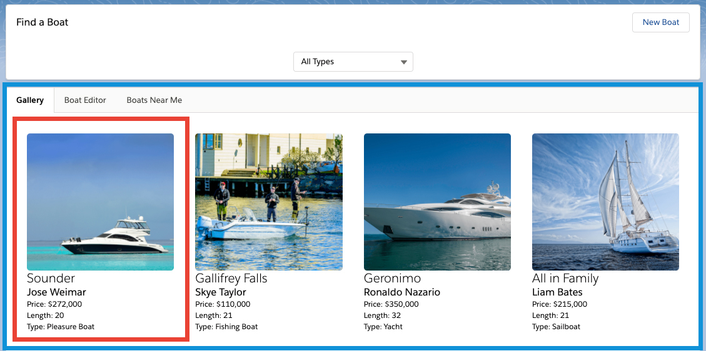

このコンポーネントは、ユーザがさまざまなアクションを実行できるようにするので、以下のようになっていることを確認してください。

* ユーザがボートのレコードを取得・更新できるように `uiRecordApi` を使用します。
* レコード操作が発生した後、そのコンポーネントや他のコンポーネントをリフレッシュします。
* トースト通知で重要なメッセージを表示します。

ボートレコードの検索は、boatSearch コンポーネント内の `searchBoats(event)` という名前の関数によって開始されなければなりません。この関数をカスタマイズして、`boatSearchResults` コンポーネントの public な関数 `searchBoats(boatTypeId)` に `boatTypeId` の値を渡し、`getBoats()` で利用できるようにします。

検索結果を取得するには、Apexクラス `BoatDataService` を使う必要があります。このクラスでは `getBoats()` というメソッドが、`String` 型の `boatTypeId` を受け取り、その `Id` でフィルタリングされたボートのリストを返します。ユーザが `All Types` を選択した場合、空の文字列がこの関数に渡されるので、すべてのタイプのすべてのボートが返されます。

このコンポーネントでは、ボートを検索する際に `loading` または `doneloading` というカスタムイベントをディスパッチする必要があります。必要なときだけイベントをディスパッチするために private なプロパティである `isLoading` を使用するようにしてください。

しかし、まず最初に、ボートタイル用のコンポーネントを用意して、イベントを処理し、正しいデータを表示することを確認しましょう。

### boatTile コンポーネントを構築する

Lightning Web コンポーネント `boatTile` に必要なコードを追加し、関数 `selectBoat()` を使ってクリックイベントに反応する `<div>` でレンタルするボートを表示します。これは `selectedBoatId` の値に応じて、関数 `tileClass()` を用いて `tile-wrapper selected` と `tile-wrapper` の間でクラスを変更しなければなりません (下の CSS セクションを参照してください)。ベストプラクティスに従い、これらの文字列をそれぞれ `TILE_WRAPPER_SELECTED_CLASS` と `TILE_WRAPPER_UNSELECTED_CLASS` という名前の定数に格納するようにしてください。

この状態は、コンポーネント全体で選択されたボートに依存しなければなりません。そのため、正しい詳細情報を送信するために必要なロジックを `selectBoat()` に追加し、`boat.Id` を `boatId` に代入し、それを `boatselect` というカスタムイベントに追加して、`boatSearchResults` コンポーネントがメッセージサービスを使用してイベントを伝播できるようにしてください。メッセージを公開 (publish) するために `boatSearchResults` コンポーネント内で `messageContext` を wire していることを確認してください。

このため、JavaScript ファイルは、タイルに表示されるボートに関する情報 (`boat`) と現在選択されているボート ID (`selectedBoatId`) を受け取るために、2つの異なる属性を必要とします。これらの属性には正しいデコレータを使用するようにしてください。

ボート画像は、クラスが `tile` に等しい `<div>` の背景として設定され、関数 `backgroundStyle()` で取得しなければなりません。この関数の戻り値は `background-image:url()` 関数を含む文字列で、`Boat__c` オブジェクト上の項目 `Picture__c` からボートの画像を表示します。

ボートの名前と所有者をタイルの下部に、`lower-third` をクラスとして使用する `<div>` の中に追加します。作成するコンポーネントは、Renata Pan が提供したデザインのように、このプロジェクトのすべての画像が見えなければなりません。

* **boat name (ボートの名前)** は `slds-truncate` と `slds-text-heading_medium` クラスを使用した `<h1>` タグ内に表示します。
* **boat's owner's name (ボートの所有者名)** は `slds-truncate` と `slds-text-heading_small` クラスを使用した `<h2>` タグ内に表示します。
* **boat price (ボートの価格)** lightning-formatted-number を使用して、小数点は最大 2 桁まで、`slds-text-body_small` クラスを使用した `<div>` タグ内に表示します。
* **boat length (ボートの長さ)** は `slds-text-body_small` クラスを使用した `<div>` タグ内に表示します。
* **boat type (ボートの種類)** は、`slds-text-body_small` クラスを使用した `<div>` タグ内に表示します。

#### マークアップ
```html
<template>
  <div onclick={selectBoat} class={tileClass}>
    <div style={backgroundStyle} class="tile"></div>
    <div class="lower-third">
      <!-- Boat information goes here -->
    </div>
  </div>
</template>
```

#### JavaScript ファイル (boatTile.js)

```js
// imports
export default class BoatTile extends LightningElement {
  boat;
  selectedBoatId;
  
  // Getter for dynamically setting the background image for the picture
  get backgroundStyle() { }
  
  // Getter for dynamically setting the tile class based on whether the
  // current boat is selected
  get tileClass() { }
  
  // Fires event with the Id of the boat that has been selected.
  selectBoat() { }
}
```

#### CSS (boatTile.css)

```css
.tile {
  width: 100%;
  height: 220px;
  padding: 1px !important;
  background-position: center;
  background-size: cover;
  border-radius: 5px;
}
.selected {
  border: 3px solid rgb(0, 95, 178);
  border-radius: 5px;
}
.tile-wrapper {
  cursor: pointer;
  padding: 5px;
}

```
## ギャラリーを構築する
コンポーネント `boatSearchResults` は `getBoats()` で返されたデータを取得し、検索結果を `wiredBoats()` という wired 関数を通じてコンポーネントの `boats` 属性に格納します。次に、`boatSearchResults` は検索結果をループして `boatTile` として表示し、レスポンシブグリッドに配置します。属性 `boats` に表示するデータが含まれている場合にのみレンダリングされる `scoped` な `<lightning-tabset>` を使用します。

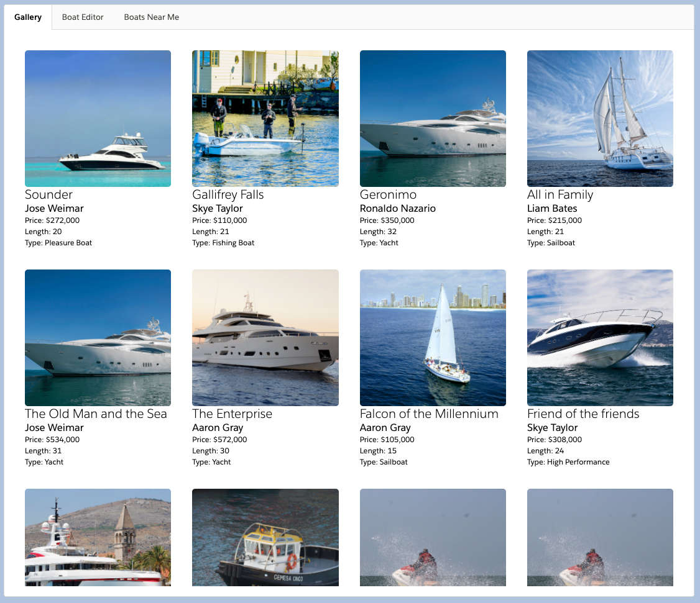

**Gallery** というラベルの `<lightning-tab>` を使ってボートタイルを表示します。Retana はこのギャラリーをスクロールできるようにしたいと言っていたので、`slds-scrollable_y` クラスを使って `<div>` を作成します。この `<div>` の中に `<lightning-layout>` を作成し、要素を水平方向中央に配置して、複数の行で表示するようにします。

コンポーネント `boatSearchResults` は、Apex メソッドから返されたデータをループしてギャラリーに `boatTile` コンポーネントを生成します。ここで、各ボートをボートタイルとして表示し、ボートのデータをループする方法が必要です。そのためには、`<template>` を作成します。`boat.data` に対して `boat` という名前で各 `item` 毎に以下の操作を行います。

* ボートの `Id` を `key` とした `<lightning-layout-item>` を表示する。
* Renata がレイアウトをレスポンシブにするように要求したので、以下のプロパティを適用します。

|プロパティ|値|
|-|-|
|Padding (パディング) |"around-small"|
|Standard size (標準サイズ) |"12"|
|Size on small devices (小さなデバイスでのサイズ) |"6"|
|Size on medium devices (中くらいのデバイスでのサイズ) |"4"|
|Size on large devices (大きなデバイスでのサイズ) |"3"|

この `<lightning-layout-item>` には各ボートタイルも含まれており、`boatTile` コンポーネントで作成した `boatselect` というカスタムイベントを利用して、現在選択されているボートの `Id` と `boat` に関する情報の両方を渡します。

現在選択されているボートに関する情報は、 `Current Boat Location` や `Details` などの他のコンポーネントに送信する必要があります。`boatSearchResults` コンポーネントでは、関数 `updateSelectedTile()` を用いて、現在選択されているボートの `Id` に関する情報をイベントに基づいて更新します。

このコンポーネントは、レコードをロードする際に既存のローディングスピナーも使用しなければならないことを忘れないでください。

### ボートエディタ - ボートをひとまとめに編集
Byanca、Renata とエンジニアリングチームは、ボートのレコードを一括で編集できるソリューションを提案しました。このソリューションを実装するために、彼らはあなたの助けを必要としています。以下のようなイメージです。

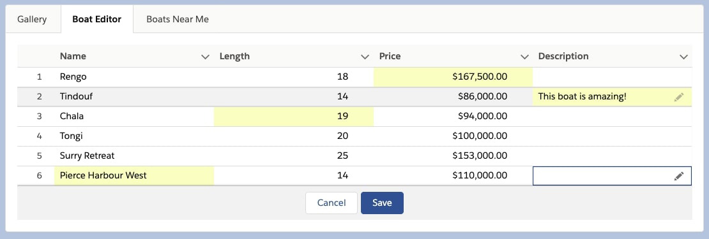

`BoatSearchResults` コンポーネントには、インライン編集を有効にしたスクロール可能なテーブル (ギャラリーで使用したのと同じ設定の `<div>` を使用) を表示する Boat Editor タブがあります。ここでは、ユーザはボートの Name (名前)、Length (長さ)、Price (価格)、Description (説明) 項目を編集することができます。

**Boat Editor** (ボートエディタ) 用の新しい `<lightning-tab>` を追加して、ラベルに `Boat Editor` を使用します。このタブの中で、`<lightning-datatable>` を使用してこの機能を実装し、ギャラリーに表示されている同じボートのデータをバインドします。データデーブルは、列 (columns) とデータ (data) を受け取ります。関数 `handleSave()` を使用して、`uiRecordApi` から `updateRecord` を使用してすべてのレコードを保存します。チェックボックスの列は非表示にしてください。

変更が正しく保存されると、データテーブルが非同期でリフレッシュされ、以下のような成功のトースト通知が表示される必要があります。

* Title (タイトル) : Success
* Message (メッセージ) : Ship It!

エラーが発生した場合には、エラーをキャッチして、イベントタイトルとして `Error` を使用して、エラーメッセージをトースト通知で表示します。

正しく保存されたら、関数 `refresh()` を呼び出して、ローディングスピナーを起動し、`refreshApex()` を呼び出して wired プロパティをリフレッシュし、スピナーを停止させてください。

### 近くにあるボート
このタブには、**Boats Near Me** (近くにあるボート) 用の新しい `<lightning-tab>` を追加し、ラベルに `Boats Near Me` を使用します。タブ内にコンポーネント `boatNearMe` を追加する際、このコンポーネントは `BoatDataService` クラスのメソッド `getBoatsByLocation()` を使用することに注意してください。このため、現在のボート種別 (`boatTypeId`) を渡すと、近くにあるボートもフィルタリングされます。

`boatNearMe` 固有の要件やスニペットについては、後ほど確認しましょう。まずは、コンポーネント `boatSearchResults` に使用するコードは以下の通りです。

#### マークアップ (boatSearchResults.html)
```html
<template>
  <lightning-tabset ...>
    <lightning-tab label="Gallery">
      <div class="slds-scrollable_y">
        <!-- layout horizontally aligned to the center  -->
        <!-- layout allowing multiple rows -->
        <lightning-layout ...>
          <!-- template looping through each boat -->
          <template ...>
            <!-- lightning-layout-item for each boat -->
            <lightning-layout-item ...>
               <!-- Each BoatTile goes here -->
            </lightning-layout-item>
          </template>
        </lightning-layout>
      </div>
    </lightning-tab>
    <lightning-tab label="Boat Editor">
      <!-- Scrollable div and lightning datatable go here -->
    </lightning-tab>
     <lightning-tab label="Boats Near Me">
      <!-- boatsNearMe component goes here -->
    </lightning-tab>
  </lightning-tabset>
</template>
```

#### JavaScript ファイル (boatSearchResults.js)

```js
// ...
export default class BoatSearchResults extends LightningElement {
  selectedBoatId;
  columns = [];
  boatTypeId = '';
  boats;
  isLoading = false;
  
  // wired message context
  messageContext;
  wiredBoats(result) { }
  
  // public function that updates the existing boatTypeId property
  // uses notifyLoading
  searchBoats(boatTypeId) { }
  
  // this public function must refresh the boats asynchronously
  // uses notifyLoading
  refresh() { }
  
  // this function must update selectedBoatId and call sendMessageService
  updateSelectedTile() { }
  
  // Publishes the selected boat Id on the BoatMC.
  sendMessageService(boatId) { }
  
  // This method must save the changes in the Boat Editor
  // Show a toast message with the title
  // clear lightning-datatable draft values
  handleSave() {
    const recordInputs = event.detail.draftValues.slice().map(draft => {
        const fields = Object.assign({}, draft);
        return { fields };
    });
    const promises = recordInputs.map(recordInput =>
            //update boat record
        );
    Promise.all(promises)
        .then(() => {})
        .catch(error => {})
        .finally(() => {});
  }
  // Check the current value of isLoading before dispatching the doneloading or loading custom event
  notifyLoading(isLoading) { }
}
```

## 地図にボートを表示する
リース契約を締結すると、HowWeRoll のクライアントは、リースしているボートをピックアップする場所を知る必要があります。このタスクのために、ボートが停泊する場所をユーザに示す地図コンポーネントをデプロイします。また、`BOATMC` という名前で `BoatMessageChannel__c` 使用し、また、アプリケーション内の至るところからディスパッチされるイベントを使用するようにコンポーネントを更新します。

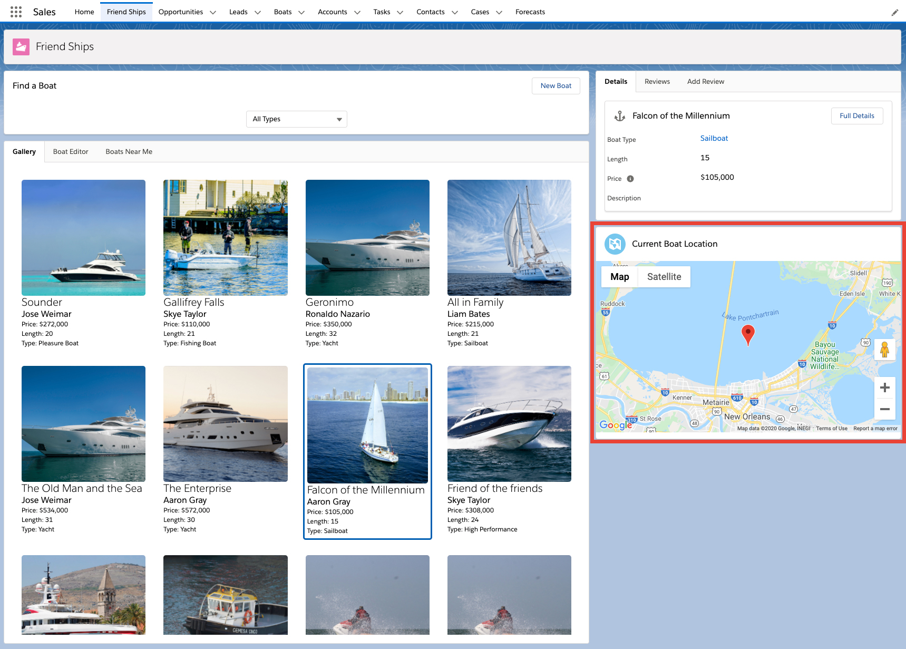

コンポーネント `boatMap` とその JavaScript ファイルは、このプロジェクトの事前準備の一部としてインストールしたロック解除済みパッケージに含まれています。必要なのは少しの修正だけです。

始める前に、コンポーネントに付属している各ファイルを確認して、それらがどのように動作するかを理解してください。この時点では、ユーザが `boatTile` をクリックするとイベント `boatselect` が起動することには慣れていることでしょう。ユーザが `boatTile` コンポーネントからボートをクリックするとイベントが起動しますが、`boatTile` のインスタンスを持つ他のコンポーネントでは、このイベントのリスナに異なるメソッドを使用していることを覚えておいてください。

ボートの`recordId` を取得できるように `connectedCallback()` 内でイベントを Subscribe (登録) するようにしてください。メッセージチャンネルを Subscribe (登録) するために `messageContext` を wire していることを確認してください。`recordId` の値が変わるたびに `uiRecordApi` の `getRecord` メソッドを使って `Geolocation__Longitude__s` と `Geolocation__Latitude__s` 項目から値を取得するようにします。そして、`updateMap()` という関数を用いて `mapMarkers` プロパティに位置を割り当てます。

これらの修正を行い、Lightning ページの右サイドバーにコンポーネント `boatMap` を追加します。

`boatMap` コンポーネントは、`<lightning-map>` を `Current Boat Location` (現在のボートの場所) というタイトルの `<lightning-card>` で囲み、ページ上の他の要素と UI の一貫性を保つためにズームレベルを 10 に設定します。

ボートの位置を表示する地図コンポーネントができたので、次は近くのボートを表示してみましょう！

## 近くのボートを表示する！
HowWeRoll Rentals は世界中にユーザがいます。Renata と Byanca は、ブラウザの位置情報とボート種別を使ってユーザの近くにあるボートを表示し、最大 10 艇を地図上に表示するソリューションを望んでいます。ブラウザの位置情報は、ページが開いている間だけユーザの同意を得て使用されます。

ここでは、ユーザの場所によって結果がどのように異なるかの例を示します。南米のユーザの場合:

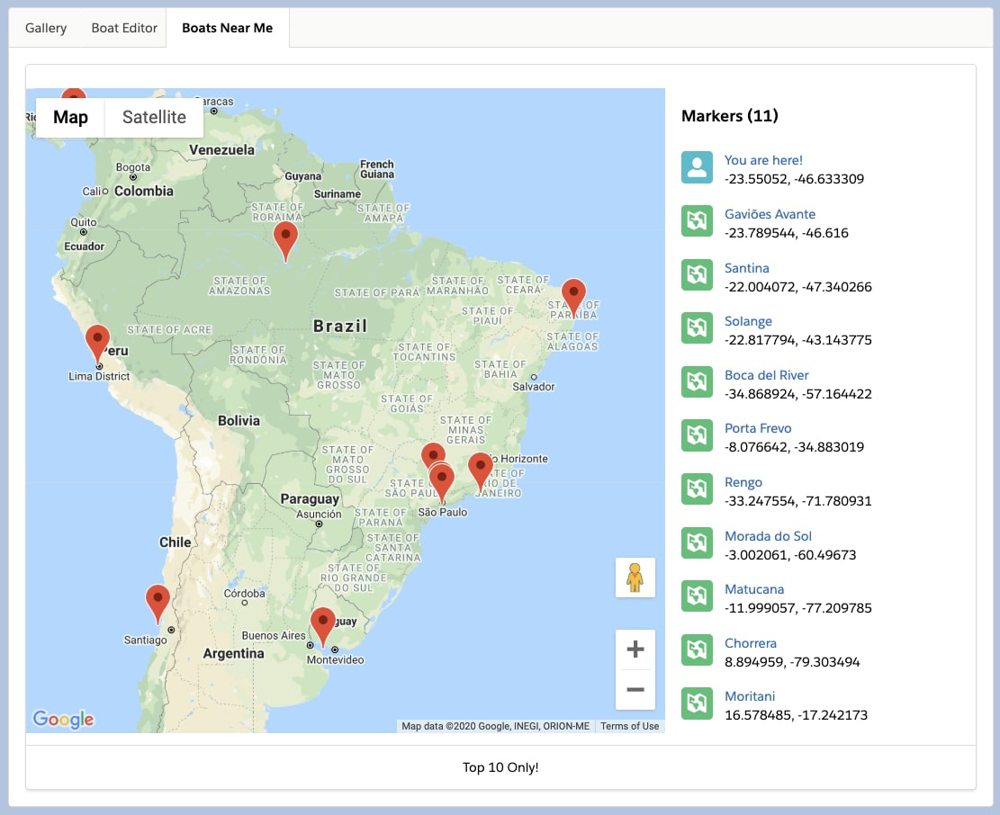

インドや中国のユーザの場合:


要点は掴めたでしょう。少し掘り下げてみましょう。実装は 3 つのステップからなります。

1. ユーザが同意した場合、ブラウザからユーザの位置情報を取得する。
2. ブラウザの位置情報(`Longitude` と `Latitude`)と現在選択されているボート種別を使って、`BoatDataService` クラスのメソッドを使ってボートをロードする。
3. Apexクラスの戻り値を用いて `<lightning-map>` のマップマーカーのリストを作成する。

それでは、`botsNearMe` コンポーネントを作成しましょう。標準の Salesforce Lightning Design System スタイルを使用して、相対位置を指定した `<lightning-card>` の中に `<lightning-map>` を作成します。

### ブラウザからユーザの現在地を取得する
`getLocationFromBrowser()` というメソッドを完成させます。このメソッドはブラウザの API を利用して、関数 `getCurrentPosition()` を使用して現在位置を取得し、座標を `latitude` と `longitude` というプロパティにアロー表記 `position => {}` で保存します:。パフォーマンスのベストプラクティスに従うには、マップがまだレンダリングされていない場合にのみブラウザから位置を取得するロジックを `renderedCallback()` に追加します。プロパティ `isRendered` を使用してください。

### 現在地からボートを取得する
これで、ユーザの位置情報がプロパティに格納されたので、`BoatDataService.getBoatsByLocation()` メソッドを呼び出し、座標と、ボート種別の `Id` を渡します。wire された `getBoatsByLocation()` の結果を扱うには、`wiredBoatsJSON({error, data})` 関数を使用します。

* 結果にデータ (data) が含まれている場合は、パラメータとして data を渡して関数 `createMapMarkers()` を呼び出します。
* エラーが発生した場合は、エラーメッセージをトーストに表示します。エラーイベントに定数 `ERROR_VARIANT`、タイトルに定数 `ERROR_TITLE` を使用します。

### 地図マーカを作成し地図にボートを表示する
地図を表示するには、JavaScript ファイルの `mapMarkers` プロパティをコンポーネントの地図マーカーとして利用する `<lightning-map>` を追加します。このプロパティは、以下のロジックを用いて `createMapMarkers(boatData)` という名前の関数によって生成されます。

* 地図マーカーの最初のマーカーには、現在のユーザの緯度と経度を指定しなければなりません。`title` には定数 `LABEL_YOU_ARE_HERE`、アイコンには定数 `ICON_STANDARD_USER` を使用します。
* このリストの他のマーカーは、`boatData` パラメータから生成する必要があります。各マーカーの `title` にはボート名を、マーカーにはボートの緯度と経度を指定する必要があります。

HTML 部分は、`<template>` の中に `<lightning-spinner>` を追加し、`alternative-text` には `Loading` を、`variant` には `brand` を用います。プロパティ `isLoading` をチェックして、スピナーを表示する必要があるかどうかを定義します。マップはスピナーをすぐに表示しなければならず、wire されたボートがロードされてマップマーカーが作成された後、または何らかのエラーが発生した場合には非表示にしなければなりません。

最後に、`mapMarkers` を渡して `<lightning-map>` を呼び出し、`<lightning-spinner>` のすぐ下に配置します。

#### マークアップ (boatsNearMe.html)
```html
<template>
  <lightning-card class="slds-is-relative">
     <!-- The template and lightning-spinner goes here -->
     <!-- The lightning-map goes here -->
     <div slot="footer">Top 10 Only!</div>
  </lightning-card>
</template>
```

#### JavaScript ファイル (boatsNearMe.js)

```js
// imports
const LABEL_YOU_ARE_HERE = 'You are here!';
const ICON_STANDARD_USER = 'standard:user';
const ERROR_TITLE = 'Error loading Boats Near Me';
const ERROR_VARIANT = 'error';
export default class BoatsNearMe extends LightningElement {
  boatTypeId;
  mapMarkers = [];
  isLoading = true;
  isRendered;
  latitude;
  longitude;
  
  // Add the wired method from the Apex Class
  // Name it getBoatsByLocation, and use latitude, longitude and boatTypeId
  // Handle the result and calls createMapMarkers
  wiredBoatsJSON({error, data}) { }
  
  // Controls the isRendered property
  // Calls getLocationFromBrowser()
  renderedCallback() { }
  
  // Gets the location from the Browser
  // position => {latitude and longitude}
  getLocationFromBrowser() { }
  
  // Creates the map markers
  createMapMarkers(boatData) {
     // const newMarkers = boatData.map(boat => {...});
     // newMarkers.unshift({...});
   }
}
```

コンポーネント `boatsNearMe` を作成したので、`boatSearchResults` 内でインスタンス化することを忘れないでください。

次のセクションでは、ボートの詳細とレビューを表示するために、Boat Details (ボートの詳細) タブをカスタマイズします。

## サードパーティのスクリプトを統合する
あなたは先見の明があります。HowWeRoll の在庫が何千ものボートに成長したとき (誰もあなたが悲観主義者だと非難したことはありませんよ！)、一目で最高のボートのリストが見られる必要があります。スクリプトで 5 つ星の評価スケールを実装します。このフェーズでは、`fiveStarRating` コンポーネントの開発を完了します。

このコンポーネントには、評価を表示するだけでクリックできない読み取り専用モードが必要です。

左の画像は、`boatAddReviewForm` コンポーネントの **edit** (編集) モードの `fiveStarRating` コンポーネントを示しています。右の画像は、`boatReviews` コンポーネントの **read-only** (読み取り専用) モードの `fiveStarRating` を示しています。


### コンポーネントを作成する
最新のコンポーネント `fiveStarRating` には、public な `value` プロパティと public な `readOnly` プロパティがあります。静的リソース `fivestar` をインポートして `fivestar` という名前で使用します。`loadScript()` 関数を使って `fivestar` 静的リソースから `rating.css` と `rating.js` ファイルをロードしてください。

スクリプトがロードされたら、`initializeRating()`という名前の関数を呼び出します。この処理中にエラーが発生した場合は、トーストにエラーメッセージを表示します。`title` に `Error loading five-star` を指定します。ベストプラクティスに従い、この文字列を `ERROR_TITLE` という定数に格納し、エラーの種類を `ERROR_VARIANT` という定数に格納してください。

HTML ファイルには `<ul>` タグがあり、クラス属性を getter 関数 `starClass` にバインドしていることに注目してください。この関数は `readOnly` 属性の値に応じて `c-rating` または `readonly c-rating` のいずれかを返すために三項演算子を使用しなければなりません。ベストプラクティスに従い、これらの文字列をそれぞれ `EDITABLE_CLASS` と `READ_ONLY_CLASS` という名前の定数に格納するようにしてください。

関数 `initializeRating()` は編集した評価の値を保存し、`ratingChanged(rating)` を呼び出して他のコンポーネントに変更を通知しています。これらの関数のロジックを完成させ、ディスパッチされるカスタムイベント名に `ratingchange` を使用してください。

#### マークアップ (fiveStarRating.html)

```html
<template>
  <ul class={starClass}></ul>
</template>
```

#### JavaScript ファイル (fiveStarRating.js)

```js
//import fivestar static resource, call it fivestar
export default class FiveStarRating extends LightningElement {
  
  //initialize public readOnly and value properties
  readOnly;
  value;
  
  // Private
  editedValue;
  isRendered;
  
  //getter function that returns the correct class depending on if it is readonly
  starClass() { }
  
  // Render callback to load the script once the component renders.
  renderedCallback() {
    if (this.isRendered) {
      return;
    }
    this.loadScript();
    this.isRendered = true;
  }
  
  //Method to load the 3rd party script and initialize the rating.
  //call the initializeRating function after scripts are loaded
  //display a toast with error message if there is an error loading script
  loadScript() { }
  initializeRating() {
    let domEl = this.template.querySelector('ul');
    let maxRating = 5;
    let self = this;
    let callback = function(rating) {
      self.editedValue = rating;
      self.ratingChanged(rating);
    };
    this.ratingObj = window.rating(
      domEl,
      this.value,
      maxRating,
      callback,
      this.readOnly
    );
  }
  
  // Method to fire event called ratingchange with the following parameter rating
  // detail: { rating } when the user selects a rating
  ratingChanged(rating) { }
}
```

これで、どのボートを見ているのかが明確になり、5つ星の評価を持つコンポーネントが動作するようになったので、ボートのレビューに使用してみましょう。

### ボートの詳細を表示する
選択したボートの詳細を表示する時が来ました。親コンポーネント `boatDetailTabs` を作成し、Lightning ページの右上のサイドバー、`boatMap` コンポーネントの上に配置します。


Renata はローカリゼーションチームと協力していますが、理想的にはユーザに表示されるテキストごとに 1 つのカスタム表示ラベルを作成することになるでしょう。新しいラベルを作成するかどうかは、社内で決めることだそうです。今のところは、既存のカスタム表示ラベルを使用してくださいとのことです。まだボートが選択されていない場合は、ユーザにボートを選択するように促すメッセージを表示します。メッセージは、`Please_select_a_boat` という名前のカスタム表示ラベルを使用し、`boatDetailTabs` のカスタムスタイル `no-boat-height` を使用して、SLDS で絶対中央配置されている `<span>` 内に表示してください。

ボートが選択されると、`boatTile` コンポーネントは `boatselect` というイベントを起動します。このイベントは、このプロジェクトの後半で `boatSearchResults` コンポーネントによって処理され、現在選択されているボートの情報が更新されます。

`scoped` な `<lightning-tabset>` の中に `<lightning-tab>` を追加します。そして、タブ内に `<lightning-card>` を追加して詳細を表示します。`title` には `boatName()` を、`icon-name` には `detailsTabIconName()` を使用します。ここでいくつかの重要な注意点があります。

* `boatId`を用いて `BOAT_FIELDS` 内の項目から値を取得するために、`uiRecordApi` の `getRecord` メソッドを使用していることを確認してください。取得した値を `wiredRecord` に代入します。
* レコードワイヤーからボート名を抽出するには、関数 `boatName()` は標準関数 `getFieldValue()` を利用しなければなりません。適切なワイヤーアダプタとインポートを使用してレコードを wire し、これを実装します。
* `detailsTabIconName()` 関数は、`wiredRecord` にデータが含まれているかどうかをチェックしなければなりません。含まれている場合は `icon` として `utility:anchor` を返さなければなりません。含まれていない場合は `null` を返さなければなりません。
* このコンポーネントが他のコンポーネントから情報を受信できるようにするには、適切なインポートを使用してください。Boat のメッセージチャネルを使用します。
* メッセージチャネルを subscribe するために `messageContext` を wire していることを確認してください。

Renata が提供したデザインに基づいて、ユーザがボートレコードに遷移できるようにボタンを作成する必要があります。以前に作成した `<lightning-card>` の中に `<lightning-button>` を追加します。actions `slot` にそれを配置し、ボタンのラベルにはカスタム表示ラベル `Full_Details` を用います。ボタンがクリックされたときに関数 `navigateToRecordViewPage()` を呼び出して `boatId` の値に基づいてレコードに移動するようにします。

標準のレコードページに移動するために、コンポーネントの基底クラスを修正します。この修正には、正しい継承と必要なデコレータをプロパティに適用することが含まれます。

ボートに関する以下の情報を表示します。

* Type (種別)
* Length (長さ)
* Price (価格)
* Description (説明)

表示密度が compact の `<lightning-record-view-form>` と各情報に対応する `<lightning-output-field>` を追加します。項目の情報を取得して表示するために、現在選択されているボートの `Id` と、オブジェクトに `Boat__c` を使用します。

次に、ボートレビューのためにさらに 2 つのタブを作成します。ラベルにカスタム表示ラベル `Reviews` を使用した `<lightning-tab>` の中に、現在選択されているボート `Id` を渡してコンポーネント `boatReviews` をインスタンス化します。このタブの `value` プロパティに `reviews` を使用すると、レビューが作成された後にこのタブに戻る際に参照できるようになります。

2 つ目の、ラベルにカスタム表示ラベル `Add_Review` を使用する `<lightning-tab>` の中で、現在選択されているボート `Id` を渡して `boatAddReviewForm` コンポーネントをインスタンス化します。関数 `handleReviewCreated()` は、後で実装する `boatAddReviewForm` コンポーネントから起動するカスタムイベント `createreview` を処理します。また、関数 `handleReviewCreated()` は、`querySelector()` と `activeTabValue` を用いて `<lightning-tabset>` の Reviews タブをアクティブに設定し、`boatReviews` コンポーネントを動的にリフレッシュしなければなりません。

#### マークアップ (boatDetailTabs.html)

```html
<template>
  <template if:false={wiredRecord.data}>
    <!-- lightning card for the label when wiredRecord has no data goes here  -->
  </template>
  <template if:true={wiredRecord.data}>
     <!-- lightning card for the content when wiredRecord has data goes here  -->
  </template>
</template>
```

#### JavaScript ファイル (boatDetailTabs.js)

```js
// Custom Labels Imports
// import labelDetails for Details
// import labelReviews for Reviews
// import labelAddReview for Add_Review
// import labelFullDetails for Full_Details
// import labelPleaseSelectABoat for Please_select_a_boat
// Boat__c Schema Imports
// import BOAT_ID_FIELD for the Boat Id
// import BOAT_NAME_FIELD for the boat Name
const BOAT_FIELDS = [BOAT_ID_FIELD, BOAT_NAME_FIELD];
export default class BoatDetailTabs extends LightningElement {
  boatId;
  wiredRecord;
  label = {
    labelDetails,
    labelReviews,
    labelAddReview,
    labelFullDetails,
    labelPleaseSelectABoat,
  };
  
  // Decide when to show or hide the icon
  // returns 'utility:anchor' or null
  get detailsTabIconName() { }
  
  // Utilize getFieldValue to extract the boat name from the record wire
  get boatName() { }
  
  // Private
  subscription = null;
  
  // Subscribe to the message channel
  subscribeMC() {}
  
  // Calls subscribeMC()
  connectedCallback() { }
  
  // Navigates to record page
  navigateToRecordViewPage() { }
  
  // Navigates back to the review list, and refreshes reviews component
  handleReviewCreated() { }
}

```

#### CSS (boatDetailTabs.css)

```css
.no-boat-height {
  height: 3rem;
}
```

これで、ボートを閲覧してフィルタリングし、ボートの詳細を表示することができるようになりました。次に、レビューを追加して表示し、セキュアな JavaScript を書き、サードパーティのスクリプトと統合し、地図上にボートをプロットします。

## ボートにレビューを追加する
HowWeRoll は全てのボートを所有しているわけではありませんので、クライアントにリースした際の、ポジティブな経験やネガティブな経験を記録しておくことが重要です。そうすれば、問題や欠陥のあるボートを除外することができます。各ボートのレビューを送信する機能を追加することで、この目的を達成しましょう。

**Submit** ボタンをクリックすると、次のアクションが実行されます。

<!-- textlint-disable jtf-style/1.1.3.箇条書き -->
* `BoatReview__c` に新しいレコードを作成します。(Lightning データサービスを使用)
* 送信が成功したことを示すトーストメッセージを表示します。
* タブを **Reviews** に切り替え、選択したボートのレビューのリストを表示 (`boatReviews` コンポーネント) します。
<!-- textlint-enable jtf-style/1.1.3.箇条書き -->

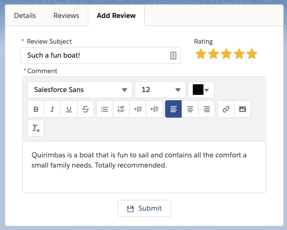

### フォームを構築する
`boatDetailTabs` コンポーネントの **Add Review** タブは、新しいコンポーネント `boatAddReviewForm` をインスタンス化し、選択したボートの `Id` を `recordId` という名前の public な setter に渡します。この setter は `recordId` の値を `boatId` に格納しなければなりません。

Tatiana は入力項目を表示するためのコンポーネントのレイアウトを作り始めましたが、完成させることができませんでした。Lightning データサービスのコードでは、`BoatReview__c` オブジェクトを参照する `<lightning-record-edit-form>` が必要です。`<lightning-record-edit-form>` レベルでは、関数 `handleSubmit()` を使ってフォームを送信し、`handleSuccess()` を使って、 title に `Review Created!` を用いた成功のトーストメッセージを表示します。ベストプラクティスに従って、タイトル文字列を `TOAST_TITLE` という定数に格納し、variant 文字列を `TOAST_SUCCESS_VARIANT` という定数に格納します。

`Review Subject` と `Comment` 項目は、Lightning データサービスを利用して `BoatReview__c` オブジェクトの `Name` と `Comment__c` 項目にバインドされています。そのため、`Name` にバインドされている `<lightning-input-field>` には `slds-form-element__label` クラスの label を使う必要があります。実際の項目のラベルを非表示にするには、variant `label-hidden` を使います。

前のステップで完成した `fiveStarRating` コンポーネントをフォームに追加し、ユーザが評価を入力できるようにします。`fiveStarRating` コンポーネントは `ratingchange` というカスタムイベントを起動し、`boatAddReviewForm` は関数 `handleRatingChanged` でそれを処理します。

項目の要件については以下の表を使用してください。

|項目|API 名|表示ラベル|必須？|
|-|-|-|-|
|Boat|`Boat__c`|なし (この項目はユーザには表示されません) |Yes (現在選択されているボートの Id)|
|Name|`Name`|`Review Subject`|Yes|
|Rating|`Rating__c`|`Rating`|Yes (デフォルト値は 0)|
|Comment|`Comment__c`|`Comment`|Yes|

**Submit** (送信)ボタンは `label` に `Submit` を設定し、 `utility:save` のアイコンを使用します。フォーム項目の上部または下部に自動的にエラーメッセージを表示します。

### 新しい BoatReview レコードを作成する
このコンポーネントは Lightning データサービスを利用して `BoatReview__c` レコードを作成します。レコードが挿入のために送信されると、関数 `handleSubmit()` はデータベースにレコードを挿入する前に `Boat__c` と `Rating__c` 項目の値を埋めます。

フォームがレコードの挿入に成功した後、関数 `handleSuccess()` を呼び出し、成功のトーストメッセージを表示して `createreview` というカスタムイベントを起動します。また、`handleReset()` 関数を呼び出し、フォームのデータをクリアします。

このコンポーネントには `handleRatingChanged()` という関数もあり、評価が更新されるたびに private なプロパティ `rating` を更新します。このプロパティの値はフォームの送信前に `Rating__c` に保存しておく必要があります。

#### マークアップ (boatAddReviewForm.html)
```html
<template>
  <!-- lightning data service code -->
  <!-- <lightning-record-edit-form> -->
    <lightning-layout multiple-rows vertical-align="start">
      <lightning-layout-item size="8" padding="horizontal-small">
        <div class="slds-form-element">
           <!-- review subject field code -->
        </div>
      </lightning-layout-item>
      <lightning-layout-item size="4" padding="horizontal-small">
        <div class="slds-form-element">
          <label class="slds-form-element__label" for="record-name">Rating</label>
          <div class="slds-form-element__control">
            <!-- add five star rating component -->
          </div>
        </div>
      </lightning-layout-item>
      <lightning-layout-item padding="horizontal-small">
           <!-- review comment field code -->
      </lightning-layout-item>
    </lightning-layout>
    <div class="slds-align_absolute-center" style="margin-top: 5px">
           <!-- add submit button -->
    </div>
  <!-- </lightning-record-edit-form> -->
</template>
```

#### JavaScript ファイル (boatAddReviewForm.js)

```js
// imports
export default class BoatAddReviewForm extends LightningElement {
  // Private
  boatId;
  rating;
  
  // Public Getter and Setter to allow for logic to run on recordId change
  get recordId() { }
  set recordId(value) {
    //sets boatId attribute
    //sets boatId assignment
  }
  
  // Gets user rating input from stars component
  handleRatingChanged(event) { }
  
  // Custom submission handler to properly set Rating
  // This function must prevent the anchor element from navigating to a URL.
  // form to be submitted: lightning-record-edit-form
  handleSubmit(event) { }
  
  // Shows a toast message once form is submitted successfully
  // Dispatches event when a review is created
  handleSuccess() {
    // TODO: dispatch the custom event and show the success message
    this.handleReset();
  }
  
  // Clears form data upon submission
  // TODO: it must reset each lightning-input-field
  handleReset() { }
}
```

### タブのフォーカスを Reviews タブに変更する
まとめていきましょう。このプロジェクトの前半に、コンポーネント `boatDetailTabs` の中に `handleReviewCreated()` という名前の関数を作成しましたよね？良かったですね！

レビューが正常に保存されると、カスタムイベント `createreview` が `boatDetailTabs` の親コンポーネントに送信され、親コンポーネントはイベントをリスンして `handleReviewCreated()` という関数を呼び出し、**Reviews** タブを現在選択されているタブに設定します。

### 選択されたボートに対するレビューを表示する
さて、ユーザがレビューを追加できる機能を実装したので、レビューを表示してみましょう。それぞれのボートには複数のレビューを登録することができます。

`boatDetailTabs` コンポーネントの **Reviews** タブは新しいコンポーネント `boatReviews` をインスタンス化し、選択したボートの `Id` を `recordId` という名前の public な setter に渡します。この setter は `recordId` の値を `boatId` に格納し、 `getReviews()` を呼び出してレビューレコードを取得する必要があります。

`BoatDataService` Apex クラスは、`getAllReviews()` という名前のメソッドを定義しており、`Id` 型の引数 `boatId` を受け取り、`BoatReview__c` のリストを返します。メソッドを確認して、どの項目が返されているかを確認してください。`getAllReviews()` メソッドがキャッシュされたリストではなく、新しく作成されたレビューを取得できることを確認してください。

コンポーネントではこのメソッドを `getAllReviews` という名前でインポートします。このメソッドは `getReviews()` 関数から imperative (命令的) に呼び出され、戻り値を private なプロパティ `boatReviews` に格納します。

`reviewsToShow()` という getter を作成します。この getter は、`boatReviews` が `null` ではなく、`undefined` でもなく、少なくとも 1 つのレコードを持つ場合に `true` を返します。それ以外の場合は `false` を返します。

`boatReviews` コンポーネントは Lightning コンポーネントを用いて独立したスクロール領域を定義します。レビューが見つからない場合、`reviewsToShow()` という getter 関数にバインドされた `No reviews available` というテキストを出力します。テキストはスクロール可能な領域内の中央に絶対配置されます。


そして、その下に 2 番目の `<div>` を追加し、`reviewsToShow()` が `true` を返した場合にのみ表示するようにします。この `<div>` は Renata が提案したデザインを維持するために以下のスタイルクラスを使用しなければなりません。`slds-feed`, `reviews-style`, `slds-is-relative`, `slds-scrollable_y` です。(これらのスタイルクラスをコピーする際には、カンマを削除してください！) このセクションには、表示されるレビューに関連するすべてのコンテンツが格納されています。

サイズが `small` の `<lightning-spinner>` を `boatReviews` にも含め、variant には `brand` を、代替テキストには `Loading` を、`getReviews()` がロード中かどうかを確認するために `isLoading` という属性を使用します。ボートのレビューが見つかった場合、`boatReview` という反復プロパティを用いて `getAllReviews` Apex メソッドで指定したすべての項目を出力します。

その下に、レビューのリストを表示します。表示は [SLDS の Feed コンポーネント](https://www.lightningdesignsystem.com/components/feeds/) の設計に準拠している必要があります。

各ボートレビューについて、レビューを作成したユーザのアバターを `SmallPhotoUrl` 項目を用いて丸形の `<lightning-avatar>` の中に表示します。アバターの隣には、ユーザの名前と、そのユーザの会社名を表示します。そのすぐ下には、`<lightning-formatted-date-time>` タグを使ってレビューが作成された日付を表示します。

レビューを投稿した人についてもっと知りたい場合もあるので、`CreatedBy` 項目にハイパーリンクを張り、`navigateToRecord()` という名前の JavaScript 関数を呼び出して、Lightning ナビゲーションサービスを利用してレコードに移動し、標準のユーザレコードページに遷移します。リンクには `data-record-id` 属性が含まれており、この属性には `boatReview.CreatedBy.Id` の値が格納されています。リンクの `title` はレビューの作成者を指定してください。関数 `navigateToRecord()` はハイパーリンクのタグに含まれる `data-record-id` 属性の値を取得し、ユーザをレビューの作成者の詳細ページに移動させるイベントを発生させます。

クラス `slds-text-longform` のある `<div>` を作成し、`slds-text-title_caps` のある `<p>` 内にレビューの件名を、`<lightning-formatted-rich-text>` 内にレビューのコメントを、そして読み取り専用モードで `fiveStarRating` を用いてレビューの評価を受け取るようにします。

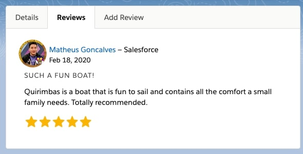

それぞれのボートレビューがクラス `slds-post` を使用する `article` の中にあることを確認してください。また、各 `article` は、`slds-post__header slds-media` クラスを使用する `header` を含むことを確認します。これにより、Renata が求めているルックアンドフィールが得られます。

このコンポーネントには `refresh()` という public な関数もあり、これは `getReviews()` を呼び出して、レビューの一覧を更新します。

詳細がたくさんありましたね。既存のスニペットを確認してワクワクすることでしょう。それでは見てみましょう。

#### マークアップ (boatReviews.html)
```html
<template>
  <!-- div for when there are no reviews available -->
  <div>No reviews available</div>
  <!-- div for when there are reviews available -->
  <div>
  <!-- insert spinner -->
    <ul class="slds-feed__list">
      <!-- start iteration -->
        <li class="slds-feed__item" key={boatReview.Id}>
          <article class="slds-post">
            <header class="slds-post__header slds-media">
              <div class="slds-media__figure">
                <!-- display the creator’s picture -->
              </div>
              <div class="slds-media__body">
                <div class="slds-grid slds-grid_align-spread slds-has-flexi-truncate">
                  <p>
                      <!-- display creator’s name -->
                    <span><!-- display creator’s company name --></span>
                  </p>
                </div>
                <p class="slds-text-body_small">
                  <!-- display created  date -->
                </p>
              </div>
            </header>
            <div class="slds-text-longform">
              <p class="slds-text-title_caps"><!-- display Name --></p>
              <!-- display Comment__c -->
            </div>
            <!-- display five star rating on readonly mode -->
          </article>
        </li>
      <!-- end iteration -->
    </ul>
  </div>
</template>
```

#### JavaScript ファイル (boatReviews.js)
```js
// imports
export default class BoatReviews extends LightningElement {
  // Private
  boatId;
  error;
  boatReviews;
  isLoading;
  
  // Getter and Setter to allow for logic to run on recordId change
  get recordId() { }
  set recordId(value) {
    //sets boatId attribute
    //sets boatId assignment
    //get reviews associated with boatId
  }
  
  // Getter to determine if there are reviews to display
  get reviewsToShow() { }
  
  // Public method to force a refresh of the reviews invoking getReviews
  refresh() { }
  
  // Imperative Apex call to get reviews for given boat
  // returns immediately if boatId is empty or null
  // sets isLoading to true during the process and false when it’s completed
  // Gets all the boatReviews from the result, checking for errors.
  getReviews() { }
  
  // Helper method to use NavigationMixin to navigate to a given record on click
  navigateToRecord(event) {  }
}

```

#### CSS (boatReviews.css)
```css
.reviews-style {
  max-height: 250px;
}
```

### コンポーネントを配置する
`boatAddReviewForm` コンポーネントの中でコンポーネントを、`boatDetailTabs` の中で `BoatReviews` コンポーネントをインスタンス化します。

この旅の最終ステップを迎えるところです。もうすぐですが、あなたの航海はまだ終わっていません。

## 似たボートのページを Lightning に変換する
HowWeRoll の Salesforce システム管理者である Weimar Williams から、Lightning への変換が必要な Visualforce ページがあることを伺いました。`SimilarBoats` という名前のページで、`SimilarBoatsComponent` という名前の Visualforce コンポーネントを使用して、表示されているボートに似たボートのリストを表示しています。このページに移動するボタンは、`Boat__c` オブジェクトのレコードページにあります。

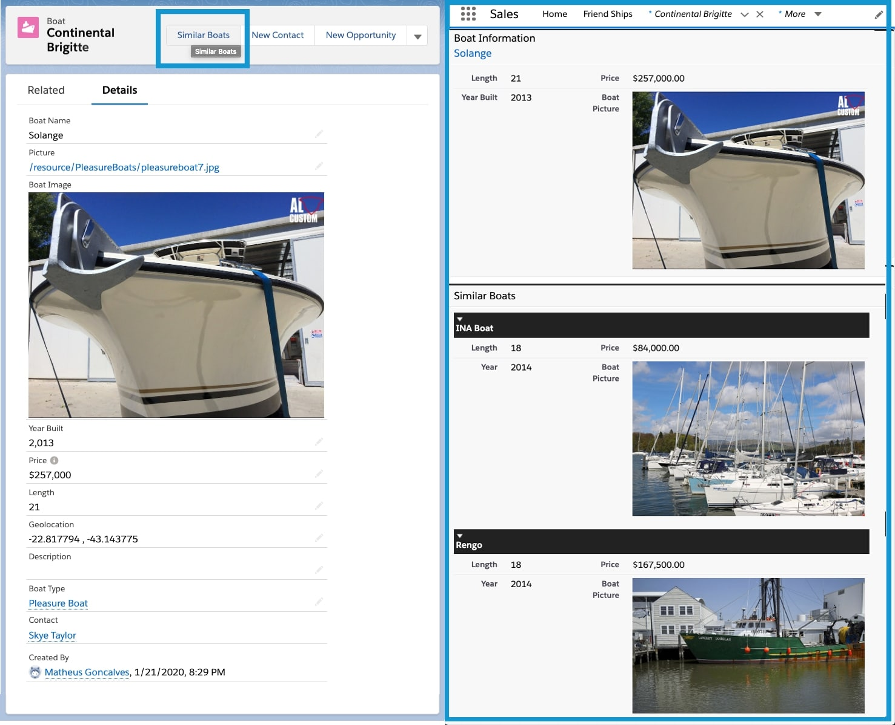

この Visualforce ページは、再利用可能な Lightning Web コンポーネントである `similarBoats` を作成するための例として使用されます。

Weimar は、システム管理者がこのコンポーネントを設定できるようにしたいと考えているので、このコンポーネントを Boat__c オブジェクトの Lightning レコードページ **Boat Record Page** で使用できるように変更を加えてください。これは、ボートを、`Type (種別)`, `Price (価格)`, `Length (長さ)` などの比較したいプロパティに基づいて、似たボートを表示します。メタデータを修正し、このフィルタのラベルに `Enter the property you want to compare by` (比較したいプロパティを入力してください) を設定します。

ロック解除済みパッケージに含まれている **Boat_Record_Page** という名前の Lightning ページに注目してください。現在のボートの位置を表示する **Current Boat Location** コンポーネントが右サイドバーに表示されるように、必要な修正を行います。`similarBoats` の各インスタンスは、**Current Boat Location** コンポーネントのすぐ下に配置されます。

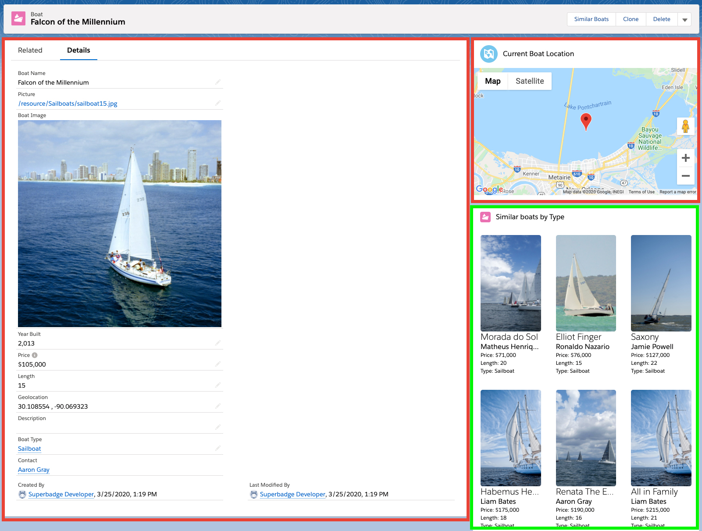

これは右サイドバーに配置された `similarBoats` コンポーネントと、メタデータで作成したフィルタです。

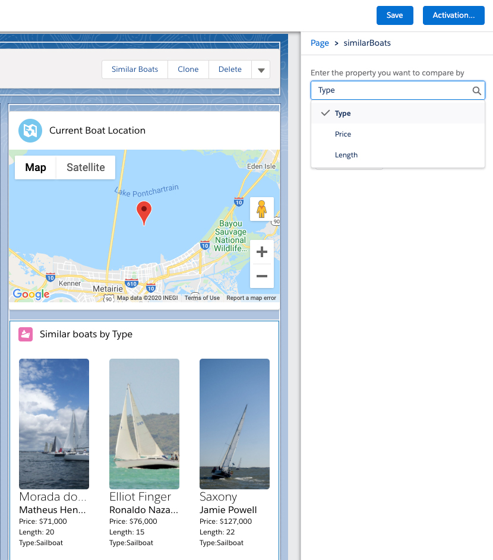

この再利用可能なコンポーネントの各インスタンスは、使用されるパラメータに基づいて、似たボートを表示します。これらの似たボートは、クラス `BoatDataService` の `getSimilarBoats` という Apex メソッドによって取得されます。このメソッドは、似たボートを問い合わせるためのパラメータとして、ボートの `Id` (`boatId`) と `String` (`similarBy`) を受け取ります。Byanca によると、Apex メソッドのロジックはすでに意図した通りに動作しているので、変更する必要はないとのことです。

ただし、この Apex 呼び出しを wire し、その結果を `relatedBoats` プロパティに格納するために、コンポーネントの JavaScript ファイルを修正する必要があります。 これは、getter の `noBoats()` と HTML 部分でループの `template` で使用されるプロパティです。

このコンポーネントは `boatTile` とその既存の動作も再利用しているので、必要なのは `relatedBoats` リストの各ボートに対してこのコンポーネントをインスタンス化することだけであることに注意してください。ボート (ループの item) をパラメータとして渡し、`openBoatDetailPage()` 関数を使用します。この関数は、`onboatselect` イベントを処理し、似たボートの Id に基づいて標準の Lightning ナビゲーションを使用して、似たボートのレコードに遷移します。 

Renata は、各 `boatTile` を格納するために使用される `<lightning-layout-item>` もレスポンシブにするよう求めています。そこで、以下のプロパティを適用します

|プロパティ|値|
|-|-|
|Padding (パディング) |"around-small"|
|Standard size (標準サイズ) |"12"|
|Size on small devices (小さなデバイスでのサイズ) |"6"|
|Size on medium devices (中くらいのデバイスでのサイズ) |"4"|
|Size on large devices (大きなデバイスでのサイズ) |"4"|

レスポンシブデザインでは、タイルや画像のサイズを変更される必要があります。以下は、このコンポーネントの一例として、種別で似たボートを表示していますが、ブラウザのウィンドウによってはタイルの幅が広がります。

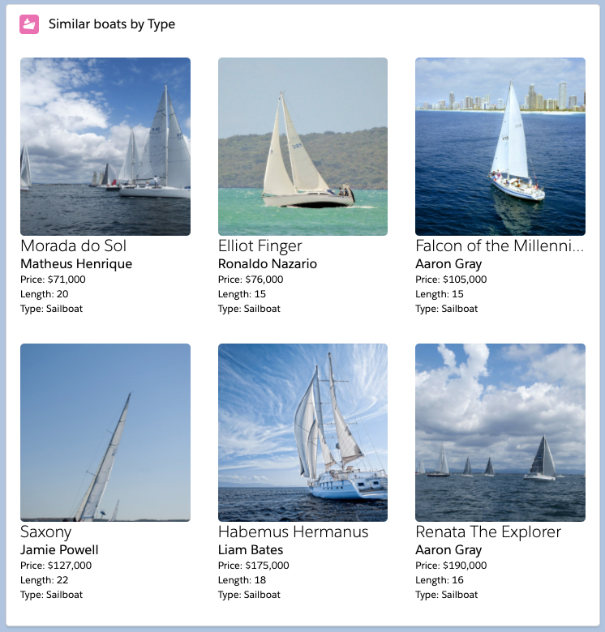

新しい `similarBoats` コンポーネントをレコードページに 3 回、各プロパティフィルタごとに 1 回ずつ配置することを忘れないでください。

#### マークアップ (similarBoats.html)
```html
<template>
  <lightning-card title={getTitle} icon-name="custom:custom54">
    <lightning-layout multiple-rows="true">
      <template if:true={noBoats}>
        <p class="slds-align_absolute-center">There are no related boats by {similarBy}!</p>
      </template>
      <!-- Loop through the list of similar boats -->
      <template ...>
        <!-- Responsive lightning-layout-item -->
        <lightning-layout-item >
          <!-- Each boat tile goes here -->
        </lightning-layout-item>
      </template>
    </lightning-layout>
  </lightning-card>
</template>
```

#### JavaScript ファイル (similarBoats.js)
```javascript
// imports
// import getSimilarBoats
export default class SimilarBoats extends LightningElement {
  // Private
  currentBoat;
  relatedBoats;
  boatId;
  error;
  
  // public
  get recordId() {
      // returns the boatId
    }
    set recordId(value) {
        // sets the boatId value
        // sets the boatId attribute
    }
  
  // public
  similarBy;
  
  // Wire custom Apex call, using the import named getSimilarBoats
  // Populates the relatedBoats list
  similarBoats({ error, data }) { }
  get getTitle() {
    return 'Similar boats by ' + this.similarBy;
  }
  get noBoats() {
    return !(this.relatedBoats && this.relatedBoats.length > 0);
  }
  
  // Navigate to record page
  openBoatDetailPage(event) { }
}
```

以上です！やりました！錨(いかり)を降ろして、ライトを消して、船のドアをロックして、素晴らしい経験をした自分を祝福してください。

## Challenge
### Challenge 1: はじめる前に
ロック解除済みパッケージのインストールを含めた全ての事前準備を完了してください。ボタンをクリックすると、このステップで Playground 組織にボートのデータが登録されます。Challenge を始める前に、[Lightning Web Components Specialist: Trailhead Challenge Help (英語)](https://trailhead.salesforce.com/help?article=Lightning-Web-Components-Specialist-Superbadge-Trailhead-Challenge-Help) のナレッジ記事を確認してください。

### Challenge 2: Boat Message Service チャネルを構築する
DOM 間での通信を行うために、Lightning Message Service のチャネルを作成する必要があります。BoatMessageChannel を組織にデプロイして、コンポーネントから参照できるようにします。

### Challenge 3: BoatDataService クラスの準備を整える
Apex クラス BoatDataService に適切な修正を行い、Lightning Web コンポーネントの中でメソッドを参照できるようにしてください。コメントを追加したり、メソッドの定義やアノテーションの間に他の内容を追加したりしないようにしてください。

### Challenge 4: コンポーネント boatSearchForm を構築する
boatSearchForm を構築して、ユーザがボート種別で結果をフィルタできるようにしてください。

### Challenge 5: コンポーネント boatTile を構築する
ボートタイルを構築して、貸し出すボートを表示します。このタイルは現在選択されているボートをセットするクリックイベントに反応します。

### Challenge 6: コンポーネント boatMap をカスタマイズする
このスーパーバッジの事前準備の一部にもなっている、組織にインストールされたロック解除済みパッケージに含まれる、コンポーネント boatMap をカスタマイズします。

### Challenge 7: コンポーネント boatsNearMe を構築して近くのボートを表示する
コンポーネント boatNearMe を作成し、ブラウザの位置とボート種別を使用して、ユーザの近くにあるボートを表示します。常にユーザの同意を得た上で (かつ、ページが開いている間のみ)、ボートを地図上に表示します。

### Challenge 8: コンポーネント boatSearchResults を構築する
コンポーネント boatSearchResults を構築して、検索結果を Gallery、Boat Editor、Boats Near Me タブで表示してください。

### Challenge 9: コンポーネント boatSearch を構築する
boatSearchForm と boatSearchResults の両方を呼び出すコンテナコンポーネント boatSearch を構築します。

ユーザが新しいボートレコードを作成できるように、ローディングスピナーとボタンを追加することを忘れないでください。

### Challenge 10: サードパーティのスクリプトを統合してコンポーネント fiveStarRating を構築する
fiveStarRating コンポーネントを作成して、ボートに 1 つ星から 5 つ星までの評価を与えることができるようにします。コンポーネントには、フォームと出力でそれぞれ使用する、編集モードと読み取り専用モードを実装します。

### Challenge 11: コンポーネント boatReviews でボートにレビューを追加する
ユーザがボートのレビューを作成できるように、コンポーネント boatAddReviewForm を作成します。Add Review タブ内に addBoatReview コンポーネントをインスタンス化し、フォームを表示します。ユーザが Submit (送信) をクリックしたら、レコードを保存し、アクティブなタブを Reviews に切り替えます。

### Challenge 12: コンポーネント boatReviews でボートのレビューを表示する
Reviews タブの中で、ビジネス要件に示されているように、ボートレビューを出力する boatReviews コンポーネントを呼び出します。可能であれば、ユーザの名前を Salesforce のレコードにハイパーリンクします。

### Challenge 13: boatDetailsTab でボートの詳細とレビューを表示する
boatReviews と boatAddReviewForm コンポーネントを boatDetailTabs に追加して、現在選択されているボートに関する詳細を表示してください。

### Challenge 14: 似たボートを表示する Lightning Web Components を使用したソリューションを構築する
既存の Visualforce ページと Visualforce コンポーネントを分析して、Lightning Web コンポーネントに備わる多くのクールな新機能を活用したソリューションを作成し、似たボートを表示します。

### Challenge 16: ボートの位置と Similar Boats コンポーネントがあるボートの Lightning レコードページを構築する
similarBoats コンポーネントを開発したので、システム管理者がボートの Lightning レコードページを設定し、Type、Length、Price で似たのボートを表示できるように修正してください。

### Challenge 17: Lightning Web Components のクイズ

### Challenge 18: ユニットテストのクイズ

## 訳注
<!-- textlint-disable jtf-style/1.1.3.箇条書き -->
* <a name="footnote1">[1]</a> : [エアストリーム (Wikipedia 日本語版)](https://ja.wikipedia.org/wiki/%E3%82%A8%E3%82%A2%E3%82%B9%E3%83%88%E3%83%AA%E3%83%BC%E3%83%A0)
* <a name="footnote2">[2]</a> : 原文は Object ですが Salesforce のオブジェクト (sObject) と混同してしまうので明示的にメタデータと記載しています。
<!-- textlint-enable jtf-style/1.1.3.箇条書き -->

## 補足とヒント
### Challenge 3
* ロック解除済みパッケージに含まれるメタデータは [Org Browser](https://developer.salesforce.com/tools/vscode/ja/user-guide/org-browser) でも取得できるようになりました。コマンドからは `sfdx force:source:retrieve -m ApexClass:BoatDataService` として個別に取得するか、 `sfdx force:source:retrieve -n LWCPackage` とするとパッケージに含まれるメタデータをすべて取得することができます。

### Challenge 12
data- 属性は、JavaScript 上、`dataset` オブジェクトを通して取得することができます。ここでは onclick イベントで起動する関数から参照するので、`event.target.dataset.recordId` となります。HTML 上でケバブケースで表現する属性は `dataset` オブジェクト上はキャメルケースになっていることに注意してください。

### Challenge 13
要件の表現がやや分かりづらいですが、[コンポーネントリファレンスの Documentation](https://developer.salesforce.com/docs/component-library/bundle/lightning-card/documentation) のように `<div slot="actions">` 〜 `</div>` で `<lightning-button>` を囲むのではなく、`<lightning-button>` そのものに `slot` 属性を適用してください。
